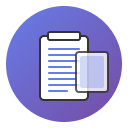

# CopyLoad - Chrome Extension

<div align="center">
  
  <h3>Lưu trữ và quản lý clipboard thông minh</h3>
  <p>Một extension Chrome/Edge mạnh mẽ để lưu trữ, quản lý và tìm kiếm các đoạn văn bản đã copy</p>
  
  [](https://chrome.google.com/webstore)
  [](https://microsoftedge.microsoft.com/addons)
  [](LICENSE)
  [](README.md)
  [](README_EN.md)
</div>
<p align="center">
Vietnamese | <a href="https://github.com/anhhackta/CopyLoad-Extension/blob/main/README_EN.md">English</a> |
  <!-- Keep these links. Translations will automatically update with the README. -->
  <a href="https://github.com/anhhackta/CopyLoad-Extension/blob/main/README_JP.md">日本語</a>
</p>
---
## 🌟 Tính năng nổi bật

### ✨ **Lưu trữ thông minh**
- **Lưu tự động**: Tự động lưu text khi sử dụng Ctrl+C
- **Lưu thủ công**: Lưu text được chọn bằng chuột phải
- **Phân loại thông minh**: Hỗ trợ 2 loại lưu trữ - tạm thời và vĩnh viễn
- **Tag thông minh**: Hiển thị tag "temp" cho clipboard tạm thời

### 🎨 **Giao diện hiện đại**
- **Dark/Light Mode**: Hỗ trợ 3 chế độ giao diện (Sáng/Tối/Theo thiết bị)
- **Đa ngôn ngữ**: Hỗ trợ tiếng Việt và tiếng Anh
- **Responsive**: Giao diện tối ưu cho mọi kích thước màn hình
- **Màu sắc hiện đại**: Sử dụng màu sắc đẹp mắt và chuyên nghiệp

### 🔍 **Tìm kiếm và quản lý**
- **Tìm kiếm real-time**: Tìm kiếm nhanh chóng trong danh sách clipboard
- **Counter thông minh**: Hiển thị số lượng clipboard đã lưu
- **Copy nhanh**: Copy lại text với một click
- **Xóa thông minh**: Xóa từng item hoặc xóa tất cả với xác nhận

### 💾 **Lưu trữ linh hoạt**
- **Toggle "Lưu vào máy"**: 
  - **Bật**: Clipboard mới → lưu vĩnh viễn (không mất khi tắt trình duyệt)
  - **Tắt**: Clipboard mới → lưu tạm thời (có tag "temp", mất khi tắt trình duyệt)
- **Download**: Tải toàn bộ danh sách ra file .txt
- **Không giới hạn**: Lưu vô hạn clipboard

---


## 📦 Cài đặt

### Cách 1: Cài đặt từ file ZIP (Khuyến nghị)

1. **Tải file ZIP** từ [releases](../../releases) hoặc từ nguồn khác
2. **Giải nén** file ZIP vào thư mục mong muốn
3. **Mở Chrome/Edge** và vào `chrome://extensions/`
4. **Bật "Developer mode"** (Chế độ nhà phát triển)
5. **Click "Load unpacked"** (Tải extension chưa đóng gói)
6. **Chọn thư mục** chứa extension đã giải nén
7. **Hoàn tất!** Extension sẽ xuất hiện trên toolbar

### Cách 2: Cài đặt từ Chrome Web Store (❌)

1. **Truy cập** [Chrome Web Store](https://chrome.google.com/webstore)
2. **Tìm kiếm** "CopyLoad"
3. **Click "Add to Chrome"**
4. **Xác nhận** cài đặt

### Cách 3: Cài đặt từ Edge Add-ons (❌)

1. **Truy cập** [Microsoft Edge Add-ons](https://microsoftedge.microsoft.com/addons)
2. **Tìm kiếm** "CopyLoad"
3. **Click "Get"**
4. **Xác nhận** cài đặt

---

## 🚀 Hướng dẫn sử dụng chi tiết

### 📋 **Lưu clipboard**

#### Lưu tự động (Ctrl+C)
1. **Chọn text** trên trang web
2. **Nhấn Ctrl+C** (hoặc Cmd+C trên Mac)
3. **Text sẽ được lưu** tự động vào danh sách
4. **Kiểm tra tag**: Nếu có tag "temp" = lưu tạm thời, không có tag = lưu vĩnh viễn

#### Lưu thủ công (Chuột phải)
1. **Chọn text** trên trang web
2. **Click chuột phải**
3. **Chọn "Lưu vào Clipboard"**
4. **Text sẽ được lưu** vĩnh viễn (không có tag temp)

### ⚙️ **Cài đặt lưu trữ**

#### Toggle "Lưu khi Ctrl+C"
- **Bật**: Tự động lưu khi Ctrl+C
- **Tắt**: Không lưu khi Ctrl+C

#### Toggle "Lưu vào máy" (Quan trọng!)
- **Bật**: Clipboard mới → lưu vĩnh viễn (không có tag temp, không mất khi tắt trình duyệt)
- **Tắt**: Clipboard mới → lưu tạm thời (có tag temp, mất khi tắt trình duyệt)

### 🎨 **Tùy chỉnh giao diện**

#### Thay đổi ngôn ngữ
1. **Click dropdown ngôn ngữ** (VN/EN)
2. **Chọn ngôn ngữ** mong muốn
3. **Giao diện sẽ thay đổi** ngay lập tức

#### Thay đổi theme
1. **Click dropdown theme** (🌙)
2. **Chọn chế độ**: ☀️ Sáng / 🌙 Tối / 🖥️ Theo thiết bị
3. **Giao diện sẽ thay đổi** ngay lập tức

### 🔍 **Tìm kiếm và quản lý**

#### Tìm kiếm clipboard
1. **Nhập từ khóa** vào ô tìm kiếm
2. **Kết quả hiển thị** real-time
3. **Counter hiển thị** số lượng kết quả

#### Copy clipboard
1. **Click nút "Copy"** bên cạnh clipboard
2. **Text sẽ được copy** vào clipboard hệ thống
3. **Thông báo thành công** sẽ hiển thị

#### Xóa clipboard
1. **Click nút "Del"** bên cạnh clipboard
2. **Clipboard sẽ bị xóa** khỏi danh sách
3. **Thông báo thành công** sẽ hiển thị

#### Xóa tất cả
1. **Click nút "Xóa hết"**
2. **Xác nhận** trong modal
3. **Tất cả clipboard** sẽ bị xóa

#### Download danh sách
1. **Click nút "Download"**
2. **File .txt** sẽ được tải về
3. **Chứa tất cả clipboard** đã lưu

---

## 🔧 Cấu trúc file

```
CopyLoad/
├── manifest.json          # Cấu hình extension
├── background.js          # Service worker xử lý background
├── content.js             # Content script lắng nghe sự kiện
├── popup.html             # Giao diện popup
├── popup.css              # CSS cho popup
├── popup.js               # JavaScript cho popup
├── icons/                 # Thư mục chứa icons
│   ├── icon16.png        # Icon 16x16
│   ├── icon48.png        # Icon 48x48
│   ├── icon128.png       # Icon 128x128
│   └── icon.svg          # Icon SVG gốc
├── README.md              # Hướng dẫn tiếng Việt
├── README_EN.md           # Hướng dẫn tiếng Anh
└── LICENSE                # Giấy phép MIT
```

---

## 🎯 Tính năng chi tiết

### 📊 **Thống kê thông minh**
- **Counter real-time**: Hiển thị số lượng clipboard
- **Phân loại**: Tag "temp" cho clipboard tạm thời
- **Tìm kiếm**: Hỗ trợ tìm kiếm nhanh chóng

### 🔄 **Đồng bộ và lưu trữ**
- **Persistent storage**: Lưu vĩnh viễn trong `chrome.storage.local`
- **Session storage**: Lưu tạm thời trong `chrome.storage.session`
- **Auto-sync**: Tự động đồng bộ giữa các tab

### 🛡️ **Bảo mật và quyền riêng tư**
- **Local storage**: Dữ liệu chỉ lưu trên máy local
- **Không gửi dữ liệu**: Không gửi clipboard lên server
- **Quyền tối thiểu**: Chỉ yêu cầu quyền cần thiết

---

## 🐛 Xử lý sự cố thường gặp

### Extension không hoạt động
1. **Kiểm tra quyền**: Đảm bảo extension có quyền truy cập trang web
2. **Reload extension**: Vào `chrome://extensions/` và click "Reload"
3. **Kiểm tra console**: Mở DevTools để xem lỗi

### Ctrl+C không lưu
1. **Kiểm tra toggle**: Đảm bảo toggle "Lưu khi Ctrl+C" đang bật
2. **Kiểm tra trang web**: Một số trang web có thể chặn sự kiện copy
3. **Thử chuột phải**: Sử dụng chuột phải để lưu thủ công

### Clipboard bị mất
1. **Kiểm tra toggle "Lưu vào máy"**: 
   - Nếu tắt: Clipboard có tag "temp" sẽ mất khi tắt trình duyệt
   - Nếu bật: Clipboard sẽ được lưu vĩnh viễn
2. **Kiểm tra storage**: Vào DevTools > Application > Storage

### Tag "temp" không hiển thị
1. **Kiểm tra toggle "Lưu vào máy"**: Phải tắt để có tag temp
2. **Reload extension**: Vào `chrome://extensions/` và click "Reload"
3. **Kiểm tra logic**: Tag temp chỉ hiển thị cho clipboard trong temp storage

---

## 🤝 Đóng góp

Chúng tôi rất hoan nghênh mọi đóng góp! Hãy:

1. **Fork** repository này
2. **Tạo branch** mới (`git checkout -b feature/AmazingFeature`)
3. **Commit** thay đổi (`git commit -m 'Add some AmazingFeature'`)
4. **Push** lên branch (`git push origin feature/AmazingFeature`)
5. **Tạo Pull Request**

### 🐛 Báo cáo lỗi
- **Tạo Issue** với mô tả chi tiết
- **Đính kèm screenshot** nếu có thể
- **Mô tả bước tái hiện** lỗi

### 💡 Đề xuất tính năng
- **Tạo Issue** với label "enhancement"
- **Mô tả chi tiết** tính năng mong muốn
- **Giải thích lợi ích** của tính năng

---

## 📄 License

Dự án này được phân phối dưới giấy phép MIT. Xem file [LICENSE](LICENSE) để biết thêm chi tiết.

---

## 👨‍💻 Tác giả

**Nguyễn Bá Hoàng** - Ủng hộ ý tưởng

- 🌐 **Website**: [anhhackta.com](https://anhhackta.com)
- 📧 **Email**: [contact@anhhackta.com](mailto:contact@anhhackta.com)
- 💬 **Facebook**: [@anhhackta](https://facebook.com/anhhackta.official)
- 💰 **Ủng hộ**: [PayPal](https://paypal.me/bahoang2k2)
- 📂 **GitHub**: [@anhhackta](https://github.com/anhhackta)

---

## ⭐ Đánh giá

Nếu bạn thích extension này, hãy:

- ⭐ **Star** repository này
- 📝 **Để lại đánh giá** trên Chrome Web Store
- 💰 **Ủng hộ** tác giả qua PayPal
- 📢 **Chia sẻ** với bạn bè

---

<div align="center">
  <p>Made with ❤️ by <a href="https://github.com/anhhackta">Nguyễn Bá Hoàng</a></p>
  <p>Hỗ trợ dự án: <a href="https://paypal.me/bahoang2k2">PayPal</a> | <a href="https://facebook.com/anhhackta.official">Facebook</a></p>
</div>
